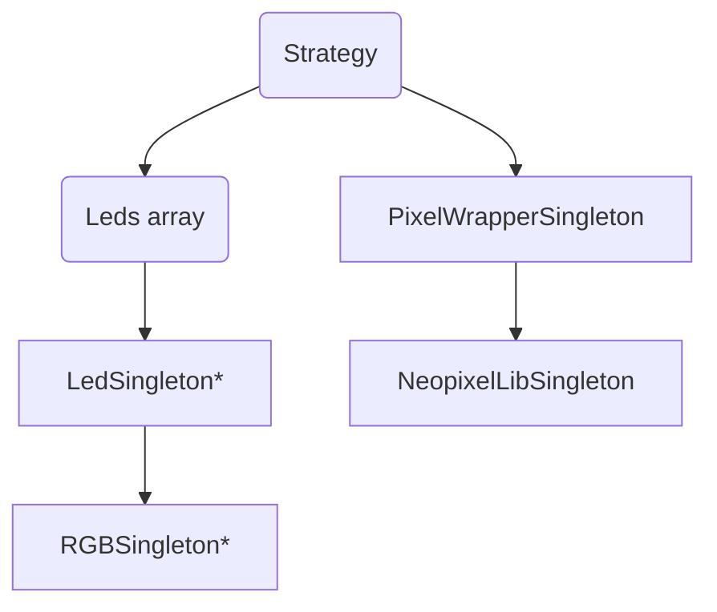

## Requirements:
- [TimeLib](https://github.com/PaulStoffregen/Time)
- [Adafruit_NeoPixel](https://github.com/adafruit/Adafruit_NeoPixel)

```mermaid
flowchart TD

S(Strategy) --> LA(Leds array)
LA(Leds array) --> LedSingleton*
LedSingleton* --> RGBSingleton*
S(Strategy) --> PixelWrapperSingleton
PixelWrapperSingleton --> NeopixelLibSingleton
```